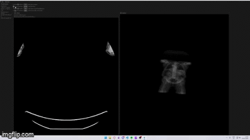

# DICOM viewer

A toy project to learn more Rust and GPU rendering. This is not a serious DICOM viewer, but it can load and display DICOM images in 2D and 3D.

## Lessons learned

- wgpu is difficult to learn.
- Syncing egui,winit,wgpu versoins is very important
- I couldnt get it to work with eframe, so I swapped that out.

## What it does

- loads DICOM data
- parses metadata and pixel data
- renders the image in a viewer window 2d and 3d with raymarching

## TODOs

- clean up the code, remove some old stuff
- improve loading and error handling
- maybe add some more features
